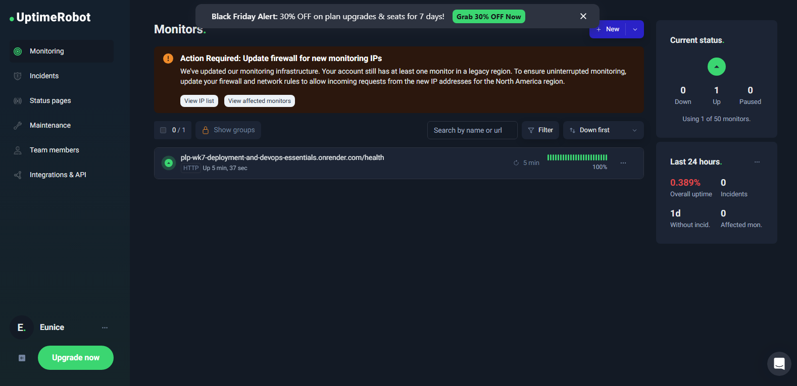

````markdown
# 🚀 MERN Stack Blog & Chat Application - Deployment & DevOps


This repository contains a full-stack MERN application (MongoDB, Express, React, Node.js) developed as part of the Power Learn Project (PLP). This week's focus was on **Deployment, DevOps, CI/CD Pipelines, and Monitoring**.

## 🌐 Live Deployment

The application is fully deployed and accessible via the following links:

- **Frontend (Vercel):** [https://plp-wk7-deployment-and-devops-essen.vercel.app/](https://plp-wk7-deployment-and-devops-essen.vercel.app/)
- **Backend API (Render):** [https://plp-wk7-deployment-and-devops-essentials.onrender.com](https://plp-wk7-deployment-and-devops-essentials.onrender.com)
- **Health Check Endpoint:** [https://plp-wk7-deployment-and-devops-essentials.onrender.com/health](https://plp-wk7-deployment-and-devops-essentials.onrender.com/health)

---

## ⚙️ DevOps & CI/CD Architecture

### 1. Continuous Integration (CI)

I have implemented a CI pipeline using **GitHub Actions** to ensure code quality and reliability.

- **Trigger:** Runs automatically on every push to the `main` branch.
- **Workflow File:** `.github/workflows/main.yml`
- **Jobs:**
  - Sets up Node.js environment.
  - Installs dependencies for both Client and Server.
  - Runs **Unit and Integration Tests** (Jest & Vitest).
  - Builds the React frontend to check for compilation errors.

### 2. Continuous Deployment (CD)

The application utilizes automatic deployment hooks:

- **Frontend:** Connected to Vercel. Automatically redeploys when the CI pipeline passes and code is merged to `main`.
- **Backend:** Connected to Render. Automatically builds and deploys the Express server upon updates to `main`.

### 3. Monitoring & Maintenance

To ensure high availability, I have set up uptime monitoring.

- **Tool:** UptimeRobot
- **Target:** Pings the `/health` API endpoint every 5 minutes.
- **Status:** Alerts are configured for downtime events.

**UptimeRobot Dashboard:**


---

## 🛠️ Local Installation & Setup

If you wish to run this project locally, follow these steps:

### 1. Clone the Repository

```bash
git clone <your-repo-url>
cd <repo-name>
```
````

### 2\. Install Dependencies

You need to install dependencies for both the server and the client.

```bash
# Install Server Dependencies
cd server
npm install

# Install Client Dependencies
cd ../client
npm install
```

### 3\. Environment Configuration

Create a `.env` file in the **server** directory with the following variables:

```env
PORT=5000
MONGODB_URI=your_mongodb_connection_string
JWT_SECRET=your_secret_key
CLIENT_URL=http://localhost:5173
NODE_ENV=development
```

Create a `.env` file in the **client** directory:

```env
VITE_API_URL=http://localhost:5000/api
VITE_SOCKET_URL=http://localhost:5000
```

### 4\. Run the Application

Open two terminals:

**Terminal 1 (Server):**

```bash
cd server
npm run dev
```

**Terminal 2 (Client):**

```bash
cd client
npm run dev
```

---

## 🧪 Running Tests

This project includes a comprehensive test suite including Unit, Integration, and End-to-End (E2E) tests.

```bash
# Run Server Tests
cd server
npm test

# Run Client Tests
cd client
npm test

# Run E2E Tests (Cypress)
npx cypress open
```

---

## 📝 API Documentation

| Method | Endpoint             | Description                               | Access  |
| :----- | :------------------- | :---------------------------------------- | :------ |
| `GET`  | `/health`            | Server status check                       | Public  |
| `GET`  | `/api/posts`         | Get all blog posts                        | Public  |
| `POST` | `/api/posts`         | Create a new post (supports image upload) | Private |
| `POST` | `/api/auth/register` | Register a new user                       | Public  |
| `POST` | `/api/auth/login`    | Login user                                | Public  |

---

## 👤 Author

**Eunique Star**

- MERN Stack Developer
- PLP Cohort

```

```
